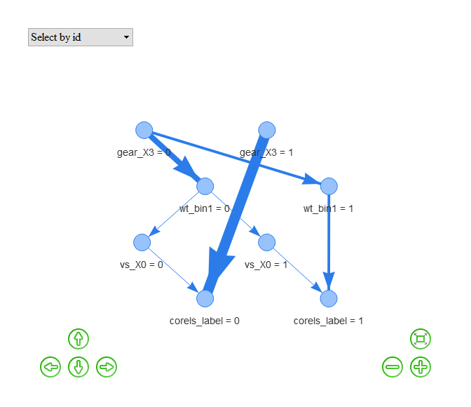

tidycorels
================

  - [What is corels and tidycorels?](#what-is-corels-and-tidycorels)
  - [Installation](#installation)
  - [tidycorels simple example](#tidycorels-simple-example)
      - [Prepare dataframe for Corels](#prepare-dataframe-for-corels)
      - [Run tidycorels](#run-tidycorels)
      - [Alluvial plot](#alluvial-plot)
      - [Performance](#performance)
  - [tidycorels for train/test data](#tidycorels-for-traintest-data)
      - [Prepare dataframe for Corels](#prepare-dataframe-for-corels-1)
      - [Run tidycorels](#run-tidycorels-1)
      - [Performance on test data](#performance-on-test-data)
      - [Alluvial plot](#alluvial-plot-1)

## What is corels and tidycorels?

> Corels are [‘Certifiably Optimal RulE
> ListS’](https://corels.eecs.harvard.edu/). They are short and simple
> human [interpretable rule lists](https://arxiv.org/pdf/1704.01701.pdf)
> created on categorical data.

`tidycorels::tidy_corels()` converts your dataframe into two text files
in the format that the R package
[corels](https://cran.r-project.org/package=corels) expects. It returns
the Corels rules converted to `dplyr::case_when()` code and applies them
to your dataframe. An insightful
[alluvial](https://github.com/erblast/easyalluvial/blob/master/README.md)
plot of the true label and the Corels classification is also returned.

`tidycorels::predict_corels()` applies the `dplyr::case_when()` rules to
a new dataframe (e.g. test data). It also returns an
[alluvial](https://github.com/erblast/easyalluvial/blob/master/README.md)
plot letting you inspect the correct and incorrect classificiations.

## Installation

``` r
devtools::install_github("billster45/tidycorels")
```

## tidycorels simple example

Let’s use tidycorels to classify cars in the `datasets::mtcars` as
either automatic or manual.

### Prepare dataframe for Corels

Using [`recipes`](https://recipes.tidymodels.org/) functions in
[`tidymodels`](https://www.tidymodels.org/), columns with continuous
values are binned or
[discretised](https://recipes.tidymodels.org/reference/step_discretize.html)
into categorial data.

Each bin in each column is then given its own 0/1 binary column using
[\`recipes::step\_dummy](https://recipes.tidymodels.org/reference/step_dummy.html).
This is sometimes called one-hot encoding.

Finally, Corels requires the label column split into two columns
representing each class. In this example `am` is the label for Corels to
classify where 0 = automatic and 1 = manual gears.

``` r
library(tidymodels)
library(corels)
library(tidycorels)
library(kableExtra)
library(easyalluvial)
library(parcats)
library(formattable)

## Using mtcars dataset and recipes, create binary predictors as Corels expects
corels_pre_proc <-
  recipes::recipe(am ~ .,
    data = datasets::mtcars
  ) %>%
  recipes::step_discretize(mpg, disp, hp, drat, wt, qsec, min_unique = 1) %>% # discretise numeric variables into bins
  recipes::step_mutate_at(recipes::all_predictors(), fn = list(~ as.factor(.))) %>%
  # convert each value of each category into its own 0/1 binary column
  recipes::step_dummy(recipes::all_predictors(), one_hot = TRUE) %>%
  recipes::step_nzv(recipes::all_predictors()) %>%
  # convert each value of the outcome into its own 0/1 binary column
  recipes::step_integer(recipes::all_outcomes(), zero_based = TRUE) %>% # ensure outcome is 0/1 rather than words
  recipes::step_mutate_at(recipes::all_outcomes(), fn = list(~ as.factor(.))) %>%
  recipes::step_dummy(recipes::all_outcomes(), one_hot = TRUE)

## Create a pre-processed dataframe from the mtcars recipe above
corels_juiced <-
  corels_pre_proc %>%
  recipes::prep() %>%
  recipes::juice()

kable_table(head(corels_juiced, 5), title = "mtcars data")
```

<table class="table table-striped table-condensed" style="width: auto !important; ">

<caption>

mtcars data

</caption>

<thead>

<tr>

<th style="text-align:right;">

mpg\_bin1

</th>

<th style="text-align:right;">

mpg\_bin2

</th>

<th style="text-align:right;">

mpg\_bin3

</th>

<th style="text-align:right;">

mpg\_bin4

</th>

<th style="text-align:right;">

cyl\_X4

</th>

<th style="text-align:right;">

cyl\_X6

</th>

<th style="text-align:right;">

cyl\_X8

</th>

<th style="text-align:right;">

disp\_bin1

</th>

<th style="text-align:right;">

disp\_bin2

</th>

<th style="text-align:right;">

disp\_bin3

</th>

<th style="text-align:right;">

disp\_bin4

</th>

<th style="text-align:right;">

hp\_bin1

</th>

<th style="text-align:right;">

hp\_bin2

</th>

<th style="text-align:right;">

hp\_bin3

</th>

<th style="text-align:right;">

hp\_bin4

</th>

<th style="text-align:right;">

drat\_bin1

</th>

<th style="text-align:right;">

drat\_bin2

</th>

<th style="text-align:right;">

drat\_bin3

</th>

<th style="text-align:right;">

drat\_bin4

</th>

<th style="text-align:right;">

wt\_bin1

</th>

<th style="text-align:right;">

wt\_bin2

</th>

<th style="text-align:right;">

wt\_bin3

</th>

<th style="text-align:right;">

wt\_bin4

</th>

<th style="text-align:right;">

qsec\_bin1

</th>

<th style="text-align:right;">

qsec\_bin2

</th>

<th style="text-align:right;">

qsec\_bin3

</th>

<th style="text-align:right;">

qsec\_bin4

</th>

<th style="text-align:right;">

vs\_X0

</th>

<th style="text-align:right;">

vs\_X1

</th>

<th style="text-align:right;">

gear\_X3

</th>

<th style="text-align:right;">

gear\_X4

</th>

<th style="text-align:right;">

gear\_X5

</th>

<th style="text-align:right;">

carb\_X1

</th>

<th style="text-align:right;">

carb\_X2

</th>

<th style="text-align:right;">

carb\_X3

</th>

<th style="text-align:right;">

carb\_X4

</th>

<th style="text-align:right;">

am\_X0

</th>

<th style="text-align:right;">

am\_X1

</th>

</tr>

</thead>

<tbody>

<tr>

<td style="text-align:right;">

0

</td>

<td style="text-align:right;">

0

</td>

<td style="text-align:right;">

1

</td>

<td style="text-align:right;">

0

</td>

<td style="text-align:right;">

0

</td>

<td style="text-align:right;">

1

</td>

<td style="text-align:right;">

0

</td>

<td style="text-align:right;">

0

</td>

<td style="text-align:right;">

1

</td>

<td style="text-align:right;">

0

</td>

<td style="text-align:right;">

0

</td>

<td style="text-align:right;">

0

</td>

<td style="text-align:right;">

1

</td>

<td style="text-align:right;">

0

</td>

<td style="text-align:right;">

0

</td>

<td style="text-align:right;">

0

</td>

<td style="text-align:right;">

0

</td>

<td style="text-align:right;">

1

</td>

<td style="text-align:right;">

0

</td>

<td style="text-align:right;">

0

</td>

<td style="text-align:right;">

1

</td>

<td style="text-align:right;">

0

</td>

<td style="text-align:right;">

0

</td>

<td style="text-align:right;">

1

</td>

<td style="text-align:right;">

0

</td>

<td style="text-align:right;">

0

</td>

<td style="text-align:right;">

0

</td>

<td style="text-align:right;">

1

</td>

<td style="text-align:right;">

0

</td>

<td style="text-align:right;">

0

</td>

<td style="text-align:right;">

1

</td>

<td style="text-align:right;">

0

</td>

<td style="text-align:right;">

0

</td>

<td style="text-align:right;">

0

</td>

<td style="text-align:right;">

0

</td>

<td style="text-align:right;">

1

</td>

<td style="text-align:right;">

0

</td>

<td style="text-align:right;">

1

</td>

</tr>

<tr>

<td style="text-align:right;">

0

</td>

<td style="text-align:right;">

0

</td>

<td style="text-align:right;">

1

</td>

<td style="text-align:right;">

0

</td>

<td style="text-align:right;">

0

</td>

<td style="text-align:right;">

1

</td>

<td style="text-align:right;">

0

</td>

<td style="text-align:right;">

0

</td>

<td style="text-align:right;">

1

</td>

<td style="text-align:right;">

0

</td>

<td style="text-align:right;">

0

</td>

<td style="text-align:right;">

0

</td>

<td style="text-align:right;">

1

</td>

<td style="text-align:right;">

0

</td>

<td style="text-align:right;">

0

</td>

<td style="text-align:right;">

0

</td>

<td style="text-align:right;">

0

</td>

<td style="text-align:right;">

1

</td>

<td style="text-align:right;">

0

</td>

<td style="text-align:right;">

0

</td>

<td style="text-align:right;">

1

</td>

<td style="text-align:right;">

0

</td>

<td style="text-align:right;">

0

</td>

<td style="text-align:right;">

0

</td>

<td style="text-align:right;">

1

</td>

<td style="text-align:right;">

0

</td>

<td style="text-align:right;">

0

</td>

<td style="text-align:right;">

1

</td>

<td style="text-align:right;">

0

</td>

<td style="text-align:right;">

0

</td>

<td style="text-align:right;">

1

</td>

<td style="text-align:right;">

0

</td>

<td style="text-align:right;">

0

</td>

<td style="text-align:right;">

0

</td>

<td style="text-align:right;">

0

</td>

<td style="text-align:right;">

1

</td>

<td style="text-align:right;">

0

</td>

<td style="text-align:right;">

1

</td>

</tr>

<tr>

<td style="text-align:right;">

0

</td>

<td style="text-align:right;">

0

</td>

<td style="text-align:right;">

1

</td>

<td style="text-align:right;">

0

</td>

<td style="text-align:right;">

1

</td>

<td style="text-align:right;">

0

</td>

<td style="text-align:right;">

0

</td>

<td style="text-align:right;">

1

</td>

<td style="text-align:right;">

0

</td>

<td style="text-align:right;">

0

</td>

<td style="text-align:right;">

0

</td>

<td style="text-align:right;">

1

</td>

<td style="text-align:right;">

0

</td>

<td style="text-align:right;">

0

</td>

<td style="text-align:right;">

0

</td>

<td style="text-align:right;">

0

</td>

<td style="text-align:right;">

0

</td>

<td style="text-align:right;">

1

</td>

<td style="text-align:right;">

0

</td>

<td style="text-align:right;">

1

</td>

<td style="text-align:right;">

0

</td>

<td style="text-align:right;">

0

</td>

<td style="text-align:right;">

0

</td>

<td style="text-align:right;">

0

</td>

<td style="text-align:right;">

0

</td>

<td style="text-align:right;">

1

</td>

<td style="text-align:right;">

0

</td>

<td style="text-align:right;">

0

</td>

<td style="text-align:right;">

1

</td>

<td style="text-align:right;">

0

</td>

<td style="text-align:right;">

1

</td>

<td style="text-align:right;">

0

</td>

<td style="text-align:right;">

1

</td>

<td style="text-align:right;">

0

</td>

<td style="text-align:right;">

0

</td>

<td style="text-align:right;">

0

</td>

<td style="text-align:right;">

0

</td>

<td style="text-align:right;">

1

</td>

</tr>

<tr>

<td style="text-align:right;">

0

</td>

<td style="text-align:right;">

0

</td>

<td style="text-align:right;">

1

</td>

<td style="text-align:right;">

0

</td>

<td style="text-align:right;">

0

</td>

<td style="text-align:right;">

1

</td>

<td style="text-align:right;">

0

</td>

<td style="text-align:right;">

0

</td>

<td style="text-align:right;">

0

</td>

<td style="text-align:right;">

1

</td>

<td style="text-align:right;">

0

</td>

<td style="text-align:right;">

0

</td>

<td style="text-align:right;">

1

</td>

<td style="text-align:right;">

0

</td>

<td style="text-align:right;">

0

</td>

<td style="text-align:right;">

1

</td>

<td style="text-align:right;">

0

</td>

<td style="text-align:right;">

0

</td>

<td style="text-align:right;">

0

</td>

<td style="text-align:right;">

0

</td>

<td style="text-align:right;">

1

</td>

<td style="text-align:right;">

0

</td>

<td style="text-align:right;">

0

</td>

<td style="text-align:right;">

0

</td>

<td style="text-align:right;">

0

</td>

<td style="text-align:right;">

0

</td>

<td style="text-align:right;">

1

</td>

<td style="text-align:right;">

0

</td>

<td style="text-align:right;">

1

</td>

<td style="text-align:right;">

1

</td>

<td style="text-align:right;">

0

</td>

<td style="text-align:right;">

0

</td>

<td style="text-align:right;">

1

</td>

<td style="text-align:right;">

0

</td>

<td style="text-align:right;">

0

</td>

<td style="text-align:right;">

0

</td>

<td style="text-align:right;">

1

</td>

<td style="text-align:right;">

0

</td>

</tr>

<tr>

<td style="text-align:right;">

0

</td>

<td style="text-align:right;">

1

</td>

<td style="text-align:right;">

0

</td>

<td style="text-align:right;">

0

</td>

<td style="text-align:right;">

0

</td>

<td style="text-align:right;">

0

</td>

<td style="text-align:right;">

1

</td>

<td style="text-align:right;">

0

</td>

<td style="text-align:right;">

0

</td>

<td style="text-align:right;">

0

</td>

<td style="text-align:right;">

1

</td>

<td style="text-align:right;">

0

</td>

<td style="text-align:right;">

0

</td>

<td style="text-align:right;">

1

</td>

<td style="text-align:right;">

0

</td>

<td style="text-align:right;">

0

</td>

<td style="text-align:right;">

1

</td>

<td style="text-align:right;">

0

</td>

<td style="text-align:right;">

0

</td>

<td style="text-align:right;">

0

</td>

<td style="text-align:right;">

0

</td>

<td style="text-align:right;">

1

</td>

<td style="text-align:right;">

0

</td>

<td style="text-align:right;">

0

</td>

<td style="text-align:right;">

1

</td>

<td style="text-align:right;">

0

</td>

<td style="text-align:right;">

0

</td>

<td style="text-align:right;">

1

</td>

<td style="text-align:right;">

0

</td>

<td style="text-align:right;">

1

</td>

<td style="text-align:right;">

0

</td>

<td style="text-align:right;">

0

</td>

<td style="text-align:right;">

0

</td>

<td style="text-align:right;">

1

</td>

<td style="text-align:right;">

0

</td>

<td style="text-align:right;">

0

</td>

<td style="text-align:right;">

1

</td>

<td style="text-align:right;">

0

</td>

</tr>

</tbody>

</table>

### Run tidycorels

The prepared dataframe can now be used in the
`tidycorels::tidy_corels()` function. We also need to specify the names
of the two columns that represent the label.

All other arguments of `corels::corels()` are available to set, other
than the following that are fixed by `tidycorels::tidy_corels()`:
`rules_file` (generated from `df`), `labels_file` (generated from `df`),
`log_dir` (set as `base::tempdir()`), `verbosity_policy` (set as
“minor”).

``` r
corels_juiced_tidy <-
  tidycorels::tidy_corels(
    df = corels_juiced,
    outcome_cols = c("am_X0", "am_X1"),
    run_bfs = TRUE,
    calculate_size = TRUE,
    run_curiosity = TRUE,
    regularization = 0.01,
    curiosity_policy = 3,
    map_type = 1
  )
```

A list of useful objects is returned. First let’s view the rules
captured from the console output of `corels::corels()`.

``` r
corels_juiced_tidy$corels_console_output[4:8]
```

    ## [1] "OPTIMAL RULE LIST"                   
    ## [2] "if ({gear:X3}) then ({am:X0})"       
    ## [3] "else if ({vs:X0}) then ({am:X1})"    
    ## [4] "else if ({disp:bin1}) then ({am:X1})"
    ## [5] "else ({am:X0})"

And see those rules converted to `dplyr::case_when()` code.

``` r
corels_juiced_tidy$dplyr_code
```

    ## [1] "dplyr::mutate(corels_prediction = dplyr::case_when(  `gear_X3` == 1 ~ '0' ,  `vs_X0` == 1 ~ '1' ,  `disp_bin1` == 1 ~ '1' , TRUE ~ '0'))"

### Alluvial plot

We can also view an
[alluvial](https://github.com/erblast/easyalluvial/blob/master/README.md)
plot of the rules applied to the data they were derived from. The
alluvial plot provides an intutivie left-to-right visual description of
how the Corels rules are sequentially applied to arrive at the final
classification.

``` r
corels_juiced_tidy$alluvial_plot
```



The leftmost column is the true label for each car, either automatic (0)
or manual (1). The rightmost column is the Corels classification after
applying the rules from left to right.

The alluvial plot clearly shows which rules are important in the
classifcation and exactly how the classifiation is arrived at. For
example, if we follow one dominannt green path of manual cars (am\_X1 =
1), they have more than 3 gears (gear\_X3 = 0), a straight engine
(vs\_x0 = 1), and low displacement volume (disp\_bin1 = 0).

``` r
t <- mtcars %>% dplyr::bind_cols(corels_juiced_tidy$alluvial_df)
```

The dataframe used to create the basic alluvial plot is also availabe to
create our own alluvial plots such as this interactive version.

``` r
p <- easyalluvial::alluvial_wide(corels_juiced_tidy$alluvial_df)

parcats::parcats(p,
  marginal_histograms = TRUE,
  data_input = corels_juiced_tidy$alluvial_df
)
```


> recorded with the excellent
> [screentogif](https://www.screentogif.com/).

### Performance

We can also create a confusion matrix from the dataframe created for the
alluvial plot.

``` r
conf_matrix <-
  corels_juiced_tidy$alluvial_df %>%
  yardstick::conf_mat(
    truth = "am_X1",
    estimate = "corels_prediction"
  )

ggplot2::autoplot(conf_matrix, "heatmap")
```

<!-- -->

And use the confusion matrix to generate performace statistics.

``` r
summary(conf_matrix) %>%
  dplyr:::mutate(.estimate = round(.estimate,digits = 3)) %>% 
  dplyr::select(.metric,.estimate) %>% 
  dplyr::filter(.metric %in% c("accuracy","precision","recall","f_meas")) %>% 
  dplyr::mutate(.estimate = color_tile("white", "orange")(.estimate)) %>%
  kableExtra::kable(escape = F) %>%
  kableExtra::kable_styling("hover", full_width = F)
```

<table class="table table-hover" style="width: auto !important; margin-left: auto; margin-right: auto;">

<thead>

<tr>

<th style="text-align:left;">

.metric

</th>

<th style="text-align:left;">

.estimate

</th>

</tr>

</thead>

<tbody>

<tr>

<td style="text-align:left;">

accuracy

</td>

<td style="text-align:left;">

<span style="display: block; padding: 0 4px; border-radius: 4px; background-color: #ffdc9e">0.969</span>

</td>

</tr>

<tr>

<td style="text-align:left;">

precision

</td>

<td style="text-align:left;">

<span style="display: block; padding: 0 4px; border-radius: 4px; background-color: #ffffff">0.950</span>

</td>

</tr>

<tr>

<td style="text-align:left;">

recall

</td>

<td style="text-align:left;">

<span style="display: block; padding: 0 4px; border-radius: 4px; background-color: #ffa500">1.000</span>

</td>

</tr>

<tr>

<td style="text-align:left;">

f\_meas

</td>

<td style="text-align:left;">

<span style="display: block; padding: 0 4px; border-radius: 4px; background-color: #ffd384">0.974</span>

</td>

</tr>

</tbody>

</table>

How do we apply the Corels rules to a new dataframe? For example, to a
hold-out or test data set?

In the following example the data is split so that we can assess the
performance of Corels rules applied to un-seen test data.

## tidycorels for train/test data

In this example, we re-use the exact `recipes` data preperation steps
from the excellent tidymodels walkthrough by [Rebecca
Barter](http://www.rebeccabarter.com/blog/2020-03-25_machine_learning/)

### Prepare dataframe for Corels

``` r
# load the Pima Indians dataset from the mlbench dataset
library(mlbench)
data(PimaIndiansDiabetes)
diabetes_orig <- PimaIndiansDiabetes

diabetes_clean <- diabetes_orig %>%
  dplyr::mutate_at(
    vars(triceps, glucose, pressure, insulin, mass),
    function(.var) {
      if_else(condition = (.var == 0), # if true (i.e. the entry is 0)
        true = as.numeric(NA), # replace the value with NA
        false = .var # otherwise leave it as it is
      )
    }
  )

kable_table(head(diabetes_clean, 5), title = "Pima Indians Dataset")
```

<table class="table table-striped table-condensed" style="width: auto !important; ">

<caption>

Pima Indians Dataset

</caption>

<thead>

<tr>

<th style="text-align:right;">

pregnant

</th>

<th style="text-align:right;">

glucose

</th>

<th style="text-align:right;">

pressure

</th>

<th style="text-align:right;">

triceps

</th>

<th style="text-align:right;">

insulin

</th>

<th style="text-align:right;">

mass

</th>

<th style="text-align:right;">

pedigree

</th>

<th style="text-align:right;">

age

</th>

<th style="text-align:left;">

diabetes

</th>

</tr>

</thead>

<tbody>

<tr>

<td style="text-align:right;">

6

</td>

<td style="text-align:right;">

148

</td>

<td style="text-align:right;">

72

</td>

<td style="text-align:right;">

35

</td>

<td style="text-align:right;">

NA

</td>

<td style="text-align:right;">

33.6

</td>

<td style="text-align:right;">

0.627

</td>

<td style="text-align:right;">

50

</td>

<td style="text-align:left;">

pos

</td>

</tr>

<tr>

<td style="text-align:right;">

1

</td>

<td style="text-align:right;">

85

</td>

<td style="text-align:right;">

66

</td>

<td style="text-align:right;">

29

</td>

<td style="text-align:right;">

NA

</td>

<td style="text-align:right;">

26.6

</td>

<td style="text-align:right;">

0.351

</td>

<td style="text-align:right;">

31

</td>

<td style="text-align:left;">

neg

</td>

</tr>

<tr>

<td style="text-align:right;">

8

</td>

<td style="text-align:right;">

183

</td>

<td style="text-align:right;">

64

</td>

<td style="text-align:right;">

NA

</td>

<td style="text-align:right;">

NA

</td>

<td style="text-align:right;">

23.3

</td>

<td style="text-align:right;">

0.672

</td>

<td style="text-align:right;">

32

</td>

<td style="text-align:left;">

pos

</td>

</tr>

<tr>

<td style="text-align:right;">

1

</td>

<td style="text-align:right;">

89

</td>

<td style="text-align:right;">

66

</td>

<td style="text-align:right;">

23

</td>

<td style="text-align:right;">

94

</td>

<td style="text-align:right;">

28.1

</td>

<td style="text-align:right;">

0.167

</td>

<td style="text-align:right;">

21

</td>

<td style="text-align:left;">

neg

</td>

</tr>

<tr>

<td style="text-align:right;">

0

</td>

<td style="text-align:right;">

137

</td>

<td style="text-align:right;">

40

</td>

<td style="text-align:right;">

35

</td>

<td style="text-align:right;">

168

</td>

<td style="text-align:right;">

43.1

</td>

<td style="text-align:right;">

2.288

</td>

<td style="text-align:right;">

33

</td>

<td style="text-align:left;">

pos

</td>

</tr>

</tbody>

</table>

The Pima Indians diabetes data set is split into train and test
datasets.

``` r
set.seed(234589)
diabetes_split <- rsample::initial_split(diabetes_clean,
  prop = 3 / 4
)

diabetes_train <- rsample::training(diabetes_split)
diabetes_test <- rsample::testing(diabetes_split)
```

We apply the same `recipe` steps as Rebecca, but with the additional
step to discretise the continous variables, and then assigning each bin
to its own 0/1 binary column.

``` r
diabetes_recipe <-
  recipes::recipe(diabetes ~ pregnant + glucose + pressure + triceps +
    insulin + mass + pedigree + age,
  data = diabetes_clean
  ) %>%
  recipes::step_normalize(all_numeric()) %>%
  recipes::step_knnimpute(all_predictors()) %>%
  # discretise numeric variables into bins
  recipes::step_discretize(pregnant, glucose, pressure, triceps, insulin, mass, pedigree, age, min_unique = 1) %>%
  recipes::step_mutate_at(recipes::all_predictors(), fn = list(~ as.factor(.))) %>%
  recipes::step_mutate_at(recipes::all_outcomes(), fn = list(~ as.factor(.))) %>%
  recipes::step_dummy(recipes::all_predictors(), one_hot = TRUE) %>% # one-hot encoude all discretised values
  recipes::step_nzv(recipes::all_predictors()) %>%
  recipes::step_integer(recipes::all_outcomes(), zero_based = TRUE) %>% # ensure outcome is 0/1 rather than words
  recipes::step_mutate_at(recipes::all_outcomes(), fn = list(~ as.factor(.))) %>%
  recipes::step_dummy(recipes::all_outcomes(), one_hot = TRUE)

diabetes_train_preprocessed <-
  diabetes_recipe %>%
  # apply the recipe to the training data
  recipes::prep(diabetes_train) %>%
  # extract the pre-processed training dataset
  recipes::juice()

kable_table(head(diabetes_train_preprocessed, 5), title = "diabetes data - juiced")
```

<table class="table table-striped table-condensed" style="width: auto !important; ">

<caption>

diabetes data - juiced

</caption>

<thead>

<tr>

<th style="text-align:right;">

pregnant\_bin1

</th>

<th style="text-align:right;">

pregnant\_bin2

</th>

<th style="text-align:right;">

pregnant\_bin3

</th>

<th style="text-align:right;">

pregnant\_bin4

</th>

<th style="text-align:right;">

glucose\_bin1

</th>

<th style="text-align:right;">

glucose\_bin2

</th>

<th style="text-align:right;">

glucose\_bin3

</th>

<th style="text-align:right;">

glucose\_bin4

</th>

<th style="text-align:right;">

pressure\_bin1

</th>

<th style="text-align:right;">

pressure\_bin2

</th>

<th style="text-align:right;">

pressure\_bin3

</th>

<th style="text-align:right;">

pressure\_bin4

</th>

<th style="text-align:right;">

triceps\_bin1

</th>

<th style="text-align:right;">

triceps\_bin2

</th>

<th style="text-align:right;">

triceps\_bin3

</th>

<th style="text-align:right;">

triceps\_bin4

</th>

<th style="text-align:right;">

insulin\_bin1

</th>

<th style="text-align:right;">

insulin\_bin2

</th>

<th style="text-align:right;">

insulin\_bin3

</th>

<th style="text-align:right;">

insulin\_bin4

</th>

<th style="text-align:right;">

mass\_bin1

</th>

<th style="text-align:right;">

mass\_bin2

</th>

<th style="text-align:right;">

mass\_bin3

</th>

<th style="text-align:right;">

mass\_bin4

</th>

<th style="text-align:right;">

pedigree\_bin1

</th>

<th style="text-align:right;">

pedigree\_bin2

</th>

<th style="text-align:right;">

pedigree\_bin3

</th>

<th style="text-align:right;">

pedigree\_bin4

</th>

<th style="text-align:right;">

age\_bin1

</th>

<th style="text-align:right;">

age\_bin2

</th>

<th style="text-align:right;">

age\_bin3

</th>

<th style="text-align:right;">

age\_bin4

</th>

<th style="text-align:right;">

diabetes\_X0

</th>

<th style="text-align:right;">

diabetes\_X1

</th>

</tr>

</thead>

<tbody>

<tr>

<td style="text-align:right;">

0

</td>

<td style="text-align:right;">

0

</td>

<td style="text-align:right;">

1

</td>

<td style="text-align:right;">

0

</td>

<td style="text-align:right;">

0

</td>

<td style="text-align:right;">

0

</td>

<td style="text-align:right;">

0

</td>

<td style="text-align:right;">

1

</td>

<td style="text-align:right;">

0

</td>

<td style="text-align:right;">

1

</td>

<td style="text-align:right;">

0

</td>

<td style="text-align:right;">

0

</td>

<td style="text-align:right;">

0

</td>

<td style="text-align:right;">

0

</td>

<td style="text-align:right;">

0

</td>

<td style="text-align:right;">

1

</td>

<td style="text-align:right;">

0

</td>

<td style="text-align:right;">

0

</td>

<td style="text-align:right;">

0

</td>

<td style="text-align:right;">

1

</td>

<td style="text-align:right;">

0

</td>

<td style="text-align:right;">

0

</td>

<td style="text-align:right;">

1

</td>

<td style="text-align:right;">

0

</td>

<td style="text-align:right;">

0

</td>

<td style="text-align:right;">

0

</td>

<td style="text-align:right;">

0

</td>

<td style="text-align:right;">

1

</td>

<td style="text-align:right;">

0

</td>

<td style="text-align:right;">

0

</td>

<td style="text-align:right;">

0

</td>

<td style="text-align:right;">

1

</td>

<td style="text-align:right;">

0

</td>

<td style="text-align:right;">

1

</td>

</tr>

<tr>

<td style="text-align:right;">

1

</td>

<td style="text-align:right;">

0

</td>

<td style="text-align:right;">

0

</td>

<td style="text-align:right;">

0

</td>

<td style="text-align:right;">

1

</td>

<td style="text-align:right;">

0

</td>

<td style="text-align:right;">

0

</td>

<td style="text-align:right;">

0

</td>

<td style="text-align:right;">

0

</td>

<td style="text-align:right;">

1

</td>

<td style="text-align:right;">

0

</td>

<td style="text-align:right;">

0

</td>

<td style="text-align:right;">

0

</td>

<td style="text-align:right;">

0

</td>

<td style="text-align:right;">

1

</td>

<td style="text-align:right;">

0

</td>

<td style="text-align:right;">

1

</td>

<td style="text-align:right;">

0

</td>

<td style="text-align:right;">

0

</td>

<td style="text-align:right;">

0

</td>

<td style="text-align:right;">

1

</td>

<td style="text-align:right;">

0

</td>

<td style="text-align:right;">

0

</td>

<td style="text-align:right;">

0

</td>

<td style="text-align:right;">

0

</td>

<td style="text-align:right;">

1

</td>

<td style="text-align:right;">

0

</td>

<td style="text-align:right;">

0

</td>

<td style="text-align:right;">

0

</td>

<td style="text-align:right;">

0

</td>

<td style="text-align:right;">

1

</td>

<td style="text-align:right;">

0

</td>

<td style="text-align:right;">

1

</td>

<td style="text-align:right;">

0

</td>

</tr>

<tr>

<td style="text-align:right;">

0

</td>

<td style="text-align:right;">

0

</td>

<td style="text-align:right;">

0

</td>

<td style="text-align:right;">

1

</td>

<td style="text-align:right;">

0

</td>

<td style="text-align:right;">

0

</td>

<td style="text-align:right;">

0

</td>

<td style="text-align:right;">

1

</td>

<td style="text-align:right;">

1

</td>

<td style="text-align:right;">

0

</td>

<td style="text-align:right;">

0

</td>

<td style="text-align:right;">

0

</td>

<td style="text-align:right;">

0

</td>

<td style="text-align:right;">

0

</td>

<td style="text-align:right;">

1

</td>

<td style="text-align:right;">

0

</td>

<td style="text-align:right;">

0

</td>

<td style="text-align:right;">

0

</td>

<td style="text-align:right;">

0

</td>

<td style="text-align:right;">

1

</td>

<td style="text-align:right;">

1

</td>

<td style="text-align:right;">

0

</td>

<td style="text-align:right;">

0

</td>

<td style="text-align:right;">

0

</td>

<td style="text-align:right;">

0

</td>

<td style="text-align:right;">

0

</td>

<td style="text-align:right;">

0

</td>

<td style="text-align:right;">

1

</td>

<td style="text-align:right;">

0

</td>

<td style="text-align:right;">

0

</td>

<td style="text-align:right;">

1

</td>

<td style="text-align:right;">

0

</td>

<td style="text-align:right;">

0

</td>

<td style="text-align:right;">

1

</td>

</tr>

<tr>

<td style="text-align:right;">

1

</td>

<td style="text-align:right;">

0

</td>

<td style="text-align:right;">

0

</td>

<td style="text-align:right;">

0

</td>

<td style="text-align:right;">

0

</td>

<td style="text-align:right;">

0

</td>

<td style="text-align:right;">

1

</td>

<td style="text-align:right;">

0

</td>

<td style="text-align:right;">

1

</td>

<td style="text-align:right;">

0

</td>

<td style="text-align:right;">

0

</td>

<td style="text-align:right;">

0

</td>

<td style="text-align:right;">

0

</td>

<td style="text-align:right;">

0

</td>

<td style="text-align:right;">

0

</td>

<td style="text-align:right;">

1

</td>

<td style="text-align:right;">

0

</td>

<td style="text-align:right;">

0

</td>

<td style="text-align:right;">

1

</td>

<td style="text-align:right;">

0

</td>

<td style="text-align:right;">

0

</td>

<td style="text-align:right;">

0

</td>

<td style="text-align:right;">

0

</td>

<td style="text-align:right;">

1

</td>

<td style="text-align:right;">

0

</td>

<td style="text-align:right;">

0

</td>

<td style="text-align:right;">

0

</td>

<td style="text-align:right;">

1

</td>

<td style="text-align:right;">

0

</td>

<td style="text-align:right;">

0

</td>

<td style="text-align:right;">

1

</td>

<td style="text-align:right;">

0

</td>

<td style="text-align:right;">

0

</td>

<td style="text-align:right;">

1

</td>

</tr>

<tr>

<td style="text-align:right;">

0

</td>

<td style="text-align:right;">

0

</td>

<td style="text-align:right;">

1

</td>

<td style="text-align:right;">

0

</td>

<td style="text-align:right;">

0

</td>

<td style="text-align:right;">

1

</td>

<td style="text-align:right;">

0

</td>

<td style="text-align:right;">

0

</td>

<td style="text-align:right;">

0

</td>

<td style="text-align:right;">

0

</td>

<td style="text-align:right;">

1

</td>

<td style="text-align:right;">

0

</td>

<td style="text-align:right;">

1

</td>

<td style="text-align:right;">

0

</td>

<td style="text-align:right;">

0

</td>

<td style="text-align:right;">

0

</td>

<td style="text-align:right;">

0

</td>

<td style="text-align:right;">

1

</td>

<td style="text-align:right;">

0

</td>

<td style="text-align:right;">

0

</td>

<td style="text-align:right;">

1

</td>

<td style="text-align:right;">

0

</td>

<td style="text-align:right;">

0

</td>

<td style="text-align:right;">

0

</td>

<td style="text-align:right;">

1

</td>

<td style="text-align:right;">

0

</td>

<td style="text-align:right;">

0

</td>

<td style="text-align:right;">

0

</td>

<td style="text-align:right;">

0

</td>

<td style="text-align:right;">

0

</td>

<td style="text-align:right;">

1

</td>

<td style="text-align:right;">

0

</td>

<td style="text-align:right;">

1

</td>

<td style="text-align:right;">

0

</td>

</tr>

</tbody>

</table>

### Run tidycorels

We can now run `tidycorels::tidy_corels()` function on the prepared
diabetes training data.

``` r
diabetes_train_model <-
  tidycorels::tidy_corels(
    df = diabetes_train_preprocessed,
    outcome_cols = c("diabetes_X0", "diabetes_X1"),
    run_bfs = TRUE,
    calculate_size = TRUE,
    run_curiosity = TRUE,
    regularization = 0.01,
    curiosity_policy = 3,
    map_type = 1
  )
```

Here are the Corels rules for the diabetes data.

``` r
diabetes_train_model$corels_console_output[2:8]
```

    ## [1] "OPTIMAL RULE LIST"                             
    ## [2] "if ({age:bin1}) then ({diabetes:X0})"          
    ## [3] "else if ({glucose:bin4}) then ({diabetes:X1})" 
    ## [4] "else if ({insulin:bin1}) then ({diabetes:X0})" 
    ## [5] "else if ({pedigree:bin1}) then ({diabetes:X0})"
    ## [6] "else if ({triceps:bin4}) then ({diabetes:X1})" 
    ## [7] "else ({diabetes:X0})"

And here are those rules converted to dplyr code.

``` r
diabetes_train_model$dplyr_code
```

    ## [1] "dplyr::mutate(corels_prediction = dplyr::case_when(  `age_bin1` == 1 ~ '0' ,  `glucose_bin4` == 1 ~ '1' ,  `insulin_bin1` == 1 ~ '0' ,  `pedigree_bin1` == 1 ~ '0' ,  `triceps_bin4` == 1 ~ '1' , TRUE ~ '0'))"

The
[alluvial](https://github.com/erblast/easyalluvial/blob/master/README.md)
plot is also available.

``` r
diabetes_train_model$alluvial_plot
```


### Performance on test data

Before we can apply the Corels rules to unseen test data, we apply the
same data preperation `recipe` created on the training data to the test
data.

``` r
diabetes_test_juiced <-
  diabetes_recipe %>%
  recipes::prep(diabetes_test) %>%
  recipes::juice()
```

Next we use the function `tidycorels::corels_predict()` to apply the
rules created on the training data to the test data.

``` r
diabetes_test_predict <-
  tidycorels::predict_corels(
    model = diabetes_train_model,
    new_df = diabetes_test_juiced
  )
```

Then plot a confusion matrix to assess the perfomrance of Corels rules
on the test data.

``` r
conf_matrix <-
  diabetes_test_predict$alluvial_df %>%
  dplyr::mutate_all(as.factor) %>%
  yardstick::conf_mat(
    truth = "diabetes_X1",
    estimate = "corels_prediction"
  )

ggplot2::autoplot(conf_matrix, "heatmap")
```

<!-- -->

The confusion matrix can be used to generate the perfomance statistics
below. The accuracy achieved by Corels on the unseen test data is 0.760.
This is higher than the random forest model used in Rebbeca’s example
which reached an accuray of 0.745 on the same test data set.

``` r
summary(conf_matrix) %>%
  dplyr:::mutate(.estimate = round(.estimate,digits = 3)) %>% 
  dplyr::select(.metric,.estimate) %>% 
  dplyr::filter(.metric %in% c("accuracy","precision","recall","f_meas")) %>% 
  dplyr::mutate(.estimate = color_tile("white", "orange")(.estimate)) %>%
  kableExtra::kable(escape = F) %>%
  kableExtra::kable_styling("hover", full_width = F)
```

<table class="table table-hover" style="width: auto !important; margin-left: auto; margin-right: auto;">

<thead>

<tr>

<th style="text-align:left;">

.metric

</th>

<th style="text-align:left;">

.estimate

</th>

</tr>

</thead>

<tbody>

<tr>

<td style="text-align:left;">

accuracy

</td>

<td style="text-align:left;">

<span style="display: block; padding: 0 4px; border-radius: 4px; background-color: #ffffff">0.760</span>

</td>

</tr>

<tr>

<td style="text-align:left;">

precision

</td>

<td style="text-align:left;">

<span style="display: block; padding: 0 4px; border-radius: 4px; background-color: #ffe3b1">0.788</span>

</td>

</tr>

<tr>

<td style="text-align:left;">

recall

</td>

<td style="text-align:left;">

<span style="display: block; padding: 0 4px; border-radius: 4px; background-color: #ffa500">0.852</span>

</td>

</tr>

<tr>

<td style="text-align:left;">

f\_meas

</td>

<td style="text-align:left;">

<span style="display: block; padding: 0 4px; border-radius: 4px; background-color: #ffc55b">0.819</span>

</td>

</tr>

</tbody>

</table>

### Alluvial plot

In contrast to the random forest model with variable importance values,
the Corels rules are easy to understand and visualise with the
interactive alluvial plot. Below is a screenshot where one path trough
the Corels rules is highlighted in darker green where individiuals known
to have diabetes are also correctly classified. We can see they are,

1.  in older age groups,
2.  have the highest blood glucose concentraion,
3.  have insulin that is one of the three highest bins,
4.  their pedigree (family history) is in one of the three highest value
    bins, and
5.  they are in the highest triceps bin (skin fold thickness).

<!-- end list -->

``` r
p <- easyalluvial::alluvial_wide(diabetes_test_predict$alluvial_df)

parcats::parcats(p,
  marginal_histograms = FALSE,
  data_input = diabetes_test_predict$alluvial_df, labelfont = 14
)
```


Further, we can build a richer undestanding of each Corels rule by
visualising the distribution of values of each bin used in each rule
within the discretised/binnned column it came from. Below, each plot
from left to right highlights the bin used in each Corels rule in
sequential order.

<!-- -->

> The plot above is created in the code below by combining the
> [discretised](https://recipes.tidymodels.org/reference/step_discretize.html)
> and one-hot encoded data with the raw column values.

``` r
diabetes_recipe_non_dummy <-
  recipes::recipe(diabetes ~ pregnant + glucose + pressure + triceps +
    insulin + mass + pedigree + age,
  data = diabetes_clean
  ) %>%
  recipes::step_normalize(all_numeric()) %>%
  recipes::step_knnimpute(all_predictors()) %>%
  # discretise numeric variables into bins
  recipes::step_discretize(pregnant, glucose, pressure, triceps, insulin, mass, pedigree, age, min_unique = 1) %>%
  recipes::step_mutate_at(recipes::all_predictors(), fn = list(~ as.factor(.))) %>%
  recipes::step_mutate_at(recipes::all_outcomes(), fn = list(~ as.factor(.)))

diabetes_train_preprocessed <-
  diabetes_recipe_non_dummy %>%
  recipes::prep(diabetes_train) %>%
  recipes::juice()

combined <- diabetes_train_preprocessed %>%
  dplyr::rename_with(toupper) %>%
  dplyr::bind_cols(diabetes_train)

plot_fun <- function(X, Y, bin) {
  X <- rlang::ensym(X)
  Y <- rlang::ensym(Y)
  bin <- rlang::ensym(bin)

  combined %>%
    ggplot2::ggplot(aes(
      x = !!X,
      y = !!Y
    )) +
    ggplot2::geom_violin(scale = "count") +
    gghighlight::gghighlight(!!X == bin) +
    ggplot2::theme_minimal()
}

p1 <- plot_fun(X = AGE, Y = age, bin = bin1)
p2 <- plot_fun(X = GLUCOSE, Y = glucose, bin = bin4)
p3 <- plot_fun(X = INSULIN, Y = insulin, bin = bin1)
p4 <- plot_fun(X = PEDIGREE, Y = pedigree, bin = bin1)
p5 <- plot_fun(X = TRICEPS, Y = triceps, bin = bin4)
final <- cowplot::plot_grid(p1, p2, p3, p4, p5)

ggplot2::ggsave(
  file = "/images/final.svg",
  device = "svg",
  plot = final
)
```
