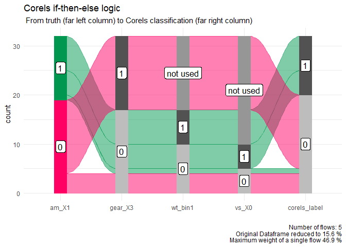

tidycorels
================

## What is corels and tidycorels?

Corels are ‘Certifiably Optimal RulE ListS’ (Corels).

tidycorels is a simple package that contains two functions to work with
the R interface to [corels](https://github.com/corels/rcppcorels).

`tidycorels::write_to_txt_file()` converts a dataframe into the text
file format [corels](https://github.com/corels/rcppcorels) expects.

`tidycorels::rules_to_case_when()` converts the rules the corels
function
[corels::corels()](https://github.com/corels/rcppcorels/blob/master/R/RcppExports.R)
returns in the console into dplyr::case\_when() code.

A simple example of how to use both functions to classify am in the
mtcars dataset is below.

## Installation

``` r
devtools::install_github(billster45/tidycorels)
```

## Example

### Prepare dataframe for corels

Using `recipes` functions in the `tidymodels` package the mtcars dataset
is converted into a dataframe of binary predictors and two columns to
represent the outcome `am` (0 = automatic, 1 = manual).

``` r
library(tidyverse)
library(tidymodels)
library(here)
library(corels)
library(tidycorels)
library(kableExtra)

## Using mtcars data and recipes, prepare data set of binary predictors in the format corels expects
corels_pre_proc <-
  recipes::recipe(am ~ ., 
                  data = datasets::mtcars) %>%
  recipes::step_discretize(mpg, disp, hp, drat, wt, qsec, min_unique = 1) %>%
  recipes::step_mutate_at(recipes::all_predictors(), fn = list(~ as.factor(.))) %>%
  recipes::step_mutate(vs = as.factor(vs)) %>%
  recipes::step_dummy(recipes::all_predictors(), one_hot = TRUE) %>%
  recipes::step_mutate(outcome_1 = case_when(am == 1 ~ 1, TRUE ~ 0), # corels requires outcome across two columns, one for each class
                       outcome_0 = case_when(am == 0 ~ 1, TRUE ~ 0)) %>%
  recipes::step_rm(am) # remove the old outcome var

## Create data frame from mtcars recipe
corels_juiced <-
  corels_pre_proc %>%
  recipes::prep() %>%
  recipes::juice()

#head(corels_juiced)
kable_table(head(corels_juiced,5),title = "mtcars data")
```

<table class="table table-striped table-condensed" style="width: auto !important; ">

<caption>

mtcars data

</caption>

<thead>

<tr>

<th style="text-align:right;">

mpg\_bin\_missing

</th>

<th style="text-align:right;">

mpg\_bin1

</th>

<th style="text-align:right;">

mpg\_bin2

</th>

<th style="text-align:right;">

mpg\_bin3

</th>

<th style="text-align:right;">

mpg\_bin4

</th>

<th style="text-align:right;">

cyl\_X4

</th>

<th style="text-align:right;">

cyl\_X6

</th>

<th style="text-align:right;">

cyl\_X8

</th>

<th style="text-align:right;">

disp\_bin\_missing

</th>

<th style="text-align:right;">

disp\_bin1

</th>

<th style="text-align:right;">

disp\_bin2

</th>

<th style="text-align:right;">

disp\_bin3

</th>

<th style="text-align:right;">

disp\_bin4

</th>

<th style="text-align:right;">

hp\_bin\_missing

</th>

<th style="text-align:right;">

hp\_bin1

</th>

<th style="text-align:right;">

hp\_bin2

</th>

<th style="text-align:right;">

hp\_bin3

</th>

<th style="text-align:right;">

hp\_bin4

</th>

<th style="text-align:right;">

drat\_bin\_missing

</th>

<th style="text-align:right;">

drat\_bin1

</th>

<th style="text-align:right;">

drat\_bin2

</th>

<th style="text-align:right;">

drat\_bin3

</th>

<th style="text-align:right;">

drat\_bin4

</th>

<th style="text-align:right;">

wt\_bin\_missing

</th>

<th style="text-align:right;">

wt\_bin1

</th>

<th style="text-align:right;">

wt\_bin2

</th>

<th style="text-align:right;">

wt\_bin3

</th>

<th style="text-align:right;">

wt\_bin4

</th>

<th style="text-align:right;">

qsec\_bin\_missing

</th>

<th style="text-align:right;">

qsec\_bin1

</th>

<th style="text-align:right;">

qsec\_bin2

</th>

<th style="text-align:right;">

qsec\_bin3

</th>

<th style="text-align:right;">

qsec\_bin4

</th>

<th style="text-align:right;">

vs\_X0

</th>

<th style="text-align:right;">

vs\_X1

</th>

<th style="text-align:right;">

gear\_X3

</th>

<th style="text-align:right;">

gear\_X4

</th>

<th style="text-align:right;">

gear\_X5

</th>

<th style="text-align:right;">

carb\_X1

</th>

<th style="text-align:right;">

carb\_X2

</th>

<th style="text-align:right;">

carb\_X3

</th>

<th style="text-align:right;">

carb\_X4

</th>

<th style="text-align:right;">

carb\_X6

</th>

<th style="text-align:right;">

carb\_X8

</th>

<th style="text-align:right;">

outcome\_1

</th>

<th style="text-align:right;">

outcome\_0

</th>

</tr>

</thead>

<tbody>

<tr>

<td style="text-align:right;">

0

</td>

<td style="text-align:right;">

0

</td>

<td style="text-align:right;">

0

</td>

<td style="text-align:right;">

1

</td>

<td style="text-align:right;">

0

</td>

<td style="text-align:right;">

0

</td>

<td style="text-align:right;">

1

</td>

<td style="text-align:right;">

0

</td>

<td style="text-align:right;">

0

</td>

<td style="text-align:right;">

0

</td>

<td style="text-align:right;">

1

</td>

<td style="text-align:right;">

0

</td>

<td style="text-align:right;">

0

</td>

<td style="text-align:right;">

0

</td>

<td style="text-align:right;">

0

</td>

<td style="text-align:right;">

1

</td>

<td style="text-align:right;">

0

</td>

<td style="text-align:right;">

0

</td>

<td style="text-align:right;">

0

</td>

<td style="text-align:right;">

0

</td>

<td style="text-align:right;">

0

</td>

<td style="text-align:right;">

1

</td>

<td style="text-align:right;">

0

</td>

<td style="text-align:right;">

0

</td>

<td style="text-align:right;">

0

</td>

<td style="text-align:right;">

1

</td>

<td style="text-align:right;">

0

</td>

<td style="text-align:right;">

0

</td>

<td style="text-align:right;">

0

</td>

<td style="text-align:right;">

1

</td>

<td style="text-align:right;">

0

</td>

<td style="text-align:right;">

0

</td>

<td style="text-align:right;">

0

</td>

<td style="text-align:right;">

1

</td>

<td style="text-align:right;">

0

</td>

<td style="text-align:right;">

0

</td>

<td style="text-align:right;">

1

</td>

<td style="text-align:right;">

0

</td>

<td style="text-align:right;">

0

</td>

<td style="text-align:right;">

0

</td>

<td style="text-align:right;">

0

</td>

<td style="text-align:right;">

1

</td>

<td style="text-align:right;">

0

</td>

<td style="text-align:right;">

0

</td>

<td style="text-align:right;">

1

</td>

<td style="text-align:right;">

0

</td>

</tr>

<tr>

<td style="text-align:right;">

0

</td>

<td style="text-align:right;">

0

</td>

<td style="text-align:right;">

0

</td>

<td style="text-align:right;">

1

</td>

<td style="text-align:right;">

0

</td>

<td style="text-align:right;">

0

</td>

<td style="text-align:right;">

1

</td>

<td style="text-align:right;">

0

</td>

<td style="text-align:right;">

0

</td>

<td style="text-align:right;">

0

</td>

<td style="text-align:right;">

1

</td>

<td style="text-align:right;">

0

</td>

<td style="text-align:right;">

0

</td>

<td style="text-align:right;">

0

</td>

<td style="text-align:right;">

0

</td>

<td style="text-align:right;">

1

</td>

<td style="text-align:right;">

0

</td>

<td style="text-align:right;">

0

</td>

<td style="text-align:right;">

0

</td>

<td style="text-align:right;">

0

</td>

<td style="text-align:right;">

0

</td>

<td style="text-align:right;">

1

</td>

<td style="text-align:right;">

0

</td>

<td style="text-align:right;">

0

</td>

<td style="text-align:right;">

0

</td>

<td style="text-align:right;">

1

</td>

<td style="text-align:right;">

0

</td>

<td style="text-align:right;">

0

</td>

<td style="text-align:right;">

0

</td>

<td style="text-align:right;">

0

</td>

<td style="text-align:right;">

1

</td>

<td style="text-align:right;">

0

</td>

<td style="text-align:right;">

0

</td>

<td style="text-align:right;">

1

</td>

<td style="text-align:right;">

0

</td>

<td style="text-align:right;">

0

</td>

<td style="text-align:right;">

1

</td>

<td style="text-align:right;">

0

</td>

<td style="text-align:right;">

0

</td>

<td style="text-align:right;">

0

</td>

<td style="text-align:right;">

0

</td>

<td style="text-align:right;">

1

</td>

<td style="text-align:right;">

0

</td>

<td style="text-align:right;">

0

</td>

<td style="text-align:right;">

1

</td>

<td style="text-align:right;">

0

</td>

</tr>

<tr>

<td style="text-align:right;">

0

</td>

<td style="text-align:right;">

0

</td>

<td style="text-align:right;">

0

</td>

<td style="text-align:right;">

1

</td>

<td style="text-align:right;">

0

</td>

<td style="text-align:right;">

1

</td>

<td style="text-align:right;">

0

</td>

<td style="text-align:right;">

0

</td>

<td style="text-align:right;">

0

</td>

<td style="text-align:right;">

1

</td>

<td style="text-align:right;">

0

</td>

<td style="text-align:right;">

0

</td>

<td style="text-align:right;">

0

</td>

<td style="text-align:right;">

0

</td>

<td style="text-align:right;">

1

</td>

<td style="text-align:right;">

0

</td>

<td style="text-align:right;">

0

</td>

<td style="text-align:right;">

0

</td>

<td style="text-align:right;">

0

</td>

<td style="text-align:right;">

0

</td>

<td style="text-align:right;">

0

</td>

<td style="text-align:right;">

1

</td>

<td style="text-align:right;">

0

</td>

<td style="text-align:right;">

0

</td>

<td style="text-align:right;">

1

</td>

<td style="text-align:right;">

0

</td>

<td style="text-align:right;">

0

</td>

<td style="text-align:right;">

0

</td>

<td style="text-align:right;">

0

</td>

<td style="text-align:right;">

0

</td>

<td style="text-align:right;">

0

</td>

<td style="text-align:right;">

1

</td>

<td style="text-align:right;">

0

</td>

<td style="text-align:right;">

0

</td>

<td style="text-align:right;">

1

</td>

<td style="text-align:right;">

0

</td>

<td style="text-align:right;">

1

</td>

<td style="text-align:right;">

0

</td>

<td style="text-align:right;">

1

</td>

<td style="text-align:right;">

0

</td>

<td style="text-align:right;">

0

</td>

<td style="text-align:right;">

0

</td>

<td style="text-align:right;">

0

</td>

<td style="text-align:right;">

0

</td>

<td style="text-align:right;">

1

</td>

<td style="text-align:right;">

0

</td>

</tr>

<tr>

<td style="text-align:right;">

0

</td>

<td style="text-align:right;">

0

</td>

<td style="text-align:right;">

0

</td>

<td style="text-align:right;">

1

</td>

<td style="text-align:right;">

0

</td>

<td style="text-align:right;">

0

</td>

<td style="text-align:right;">

1

</td>

<td style="text-align:right;">

0

</td>

<td style="text-align:right;">

0

</td>

<td style="text-align:right;">

0

</td>

<td style="text-align:right;">

0

</td>

<td style="text-align:right;">

1

</td>

<td style="text-align:right;">

0

</td>

<td style="text-align:right;">

0

</td>

<td style="text-align:right;">

0

</td>

<td style="text-align:right;">

1

</td>

<td style="text-align:right;">

0

</td>

<td style="text-align:right;">

0

</td>

<td style="text-align:right;">

0

</td>

<td style="text-align:right;">

1

</td>

<td style="text-align:right;">

0

</td>

<td style="text-align:right;">

0

</td>

<td style="text-align:right;">

0

</td>

<td style="text-align:right;">

0

</td>

<td style="text-align:right;">

0

</td>

<td style="text-align:right;">

1

</td>

<td style="text-align:right;">

0

</td>

<td style="text-align:right;">

0

</td>

<td style="text-align:right;">

0

</td>

<td style="text-align:right;">

0

</td>

<td style="text-align:right;">

0

</td>

<td style="text-align:right;">

0

</td>

<td style="text-align:right;">

1

</td>

<td style="text-align:right;">

0

</td>

<td style="text-align:right;">

1

</td>

<td style="text-align:right;">

1

</td>

<td style="text-align:right;">

0

</td>

<td style="text-align:right;">

0

</td>

<td style="text-align:right;">

1

</td>

<td style="text-align:right;">

0

</td>

<td style="text-align:right;">

0

</td>

<td style="text-align:right;">

0

</td>

<td style="text-align:right;">

0

</td>

<td style="text-align:right;">

0

</td>

<td style="text-align:right;">

0

</td>

<td style="text-align:right;">

1

</td>

</tr>

<tr>

<td style="text-align:right;">

0

</td>

<td style="text-align:right;">

0

</td>

<td style="text-align:right;">

1

</td>

<td style="text-align:right;">

0

</td>

<td style="text-align:right;">

0

</td>

<td style="text-align:right;">

0

</td>

<td style="text-align:right;">

0

</td>

<td style="text-align:right;">

1

</td>

<td style="text-align:right;">

0

</td>

<td style="text-align:right;">

0

</td>

<td style="text-align:right;">

0

</td>

<td style="text-align:right;">

0

</td>

<td style="text-align:right;">

1

</td>

<td style="text-align:right;">

0

</td>

<td style="text-align:right;">

0

</td>

<td style="text-align:right;">

0

</td>

<td style="text-align:right;">

1

</td>

<td style="text-align:right;">

0

</td>

<td style="text-align:right;">

0

</td>

<td style="text-align:right;">

0

</td>

<td style="text-align:right;">

1

</td>

<td style="text-align:right;">

0

</td>

<td style="text-align:right;">

0

</td>

<td style="text-align:right;">

0

</td>

<td style="text-align:right;">

0

</td>

<td style="text-align:right;">

0

</td>

<td style="text-align:right;">

1

</td>

<td style="text-align:right;">

0

</td>

<td style="text-align:right;">

0

</td>

<td style="text-align:right;">

0

</td>

<td style="text-align:right;">

1

</td>

<td style="text-align:right;">

0

</td>

<td style="text-align:right;">

0

</td>

<td style="text-align:right;">

1

</td>

<td style="text-align:right;">

0

</td>

<td style="text-align:right;">

1

</td>

<td style="text-align:right;">

0

</td>

<td style="text-align:right;">

0

</td>

<td style="text-align:right;">

0

</td>

<td style="text-align:right;">

1

</td>

<td style="text-align:right;">

0

</td>

<td style="text-align:right;">

0

</td>

<td style="text-align:right;">

0

</td>

<td style="text-align:right;">

0

</td>

<td style="text-align:right;">

0

</td>

<td style="text-align:right;">

1

</td>

</tr>

</tbody>

</table>

### convert data frame to text files for corels

The predictors

``` r
# extract only the mtcars predictor column names
cols <- colnames(corels_juiced %>%
                   dplyr::select(-outcome_1,-outcome_0))

# write only mtcar predictor columns to a training text file
train_text_file <- paste0(here::here(),"/train.txt")
tidycorels::write_to_txt_file(df = corels_juiced,
                  cols = cols,
                  txt_file = train_text_file)
file.show(train_text_file)
```

The outcome

``` r
# Create outcome text file for corels
cols <- colnames(corels_juiced %>% dplyr::select(outcome_1,outcome_0))

outcome_text_file <- paste0(here::here(),"/labels.txt")
write_to_txt_file(df = corels_juiced,
                  cols = cols,
                  txt_file = outcome_text_file)
file.show(outcome_text_file)
```

### run Corels and capture rules

We can now use the text files as input to the `corels::corels()`
function.

``` r
# use text files in corels to make prediction
logdir <- tempdir()

corels_console_output <-
  utils::capture.output({ # capture output to convert into code
  corels::corels(rules_file = train_text_file,
                 labels_file = outcome_text_file,
                 log_dir = logdir,
                 run_bfs = TRUE,
                 calculate_size = TRUE,
                 run_curiosity = TRUE,
                 verbosity_policy = "minor",
                 regularization = 0.01,
                 curiosity_policy = 3, # by lower bound
                 map_type = 1)
})

# show rules
corels_console_output[4:8]
```

    ## [1] "OPTIMAL RULE LIST"                     
    ## [2] "if ({gear:X3}) then ({outcome:0})"     
    ## [3] "else if ({wt:bin1}) then ({outcome:1})"
    ## [4] "else if ({vs:X0}) then ({outcome:1})"  
    ## [5] "else ({outcome:0})"

### convert rules to dplyr::case\_when() and apply to dataframe

``` r
# convert rules to dplyr::case_when() logic
dplyr_code <- tidycorels::rules_to_case_when(corels_output = corels_console_output)

dplyr_code <- paste0("mtcars_pred <- corels_juiced %>% ", dplyr_code)

dplyr_code
```

    ## [1] "mtcars_pred <- corels_juiced %>% dplyr::mutate(corel_prediction = dplyr::case_when(  `gear_X3` == 1 ~ 0 ,  `wt_bin1` == 1 ~ 1 ,  `vs_X0` == 1 ~ 1 , TRUE ~ 0))"

``` r
base::eval(base::parse(text = dplyr_code))

mtcars_pred <-
  mtcars_pred %>%
  dplyr::bind_cols(dplyr::select(mtcars,am)) %>%
  dplyr::mutate_all(factor)
```

### compre Corels classification to truth

``` r
conf_matrix <-
  yardstick::conf_mat(mtcars_pred,
                          truth = "am",
                          estimate = "corel_prediction")

ggplot2::autoplot(conf_matrix, type = "heatmap")
```

<!-- -->
