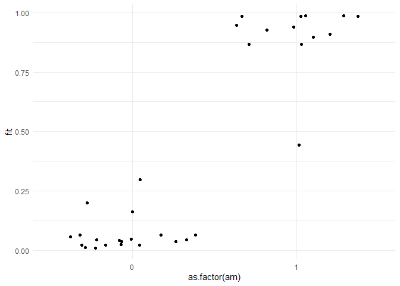

tidycorels
================

  - [What are corels and tidycorels?](#what-are-corels-and-tidycorels)
  - [Installation](#installation)
  - [Simple example](#simple-example)
      - [Prepare dataframe for Corels](#prepare-dataframe-for-corels)
      - [Alluvial plot](#alluvial-plot)
      - [Performance on training data](#performance-on-training-data)
      - [Performance of each rule](#performance-of-each-rule)
      - [Performance on new data](#performance-on-new-data)
      - [Comparison to XGBoost rules](#comparison-to-xgboost-rules)

## What are corels and tidycorels?

> Corels are [‘Certifiably Optimal RulE
> ListS’](https://corels.eecs.harvard.edu/). They are short and simple
> human [interpretable rule lists](https://arxiv.org/pdf/1704.01701.pdf)
> created on categorical data.

The Corels authors
[say](https://corels.eecs.harvard.edu/corels/whatarerulelists.html)
that.. *“The advantage of rule lists as predictive models is that they
are human interpretable, as opposed to black box models such as neural
nets. Proponents of such non-interpretable models often claim that they
are necessary to achieve greater accuracy, but we have shown that it is
possible for rule lists to have comparable or even greater accuracy.”*

`tidycorels::tidy_corels()` converts your dataframe into two text files
in the format the R package
[corels](https://cran.r-project.org/package=corels) expects. It returns
the Corels rules as well as applying them to your dataframe using
[`data.table::fifelse()`](https://rdatatable.gitlab.io/data.table/reference/fifelse.html)
code. Your dataframe is also returned with fewer columns ready to be
used in an insightful
[alluvial](https://github.com/erblast/easyalluvial/blob/master/README.md)
plot. It can reveal intuitively both how the Corels rules are applied to
your dataframe, and where the classification is correct or incorrect.

## Installation

``` r
devtools::install_github("billster45/tidycorels")
```

## Simple example

Let’s use tidycorels to classify cars in `datasets::mtcars` as either
automatic or manual.

### Prepare dataframe for Corels

Using [`recipes`](https://recipes.tidymodels.org/) functions in
[`tidymodels`](https://www.tidymodels.org/), columns with continuous
values are binned or
[discretised](https://recipes.tidymodels.org/reference/step_discretize.html)
into categorical data. Each bin in each column is given its own 0/1
binary column using
[\`recipes::step\_dummy()](https://recipes.tidymodels.org/reference/step_dummy.html).
This is sometimes called one-hot encoding.

Corels also requires the label column is split into two columns
representing each class. In this example, `am` is the label for Corels
to classify where 0 = automatic and 1 = manual gears.

``` r
library(tidymodels)
library(tidypredict)
library(corels)
library(tidycorels)
library(xgboost)
library(easyalluvial)
library(parcats)
library(networkD3)
library(visNetwork)
library(formattable)

mtcars_recipe <-recipes::recipe(am ~ ., data = datasets::mtcars) %>%
  # 1 discretise continous variables into bins
  recipes::step_discretize(mpg, disp, hp, drat, wt, qsec, min_unique = 1) %>% 
  # 2 convert each value of each predictor into its own 0/1 binary column
  recipes::step_mutate_at(recipes::all_predictors(), fn = list(~ as.factor(.))) %>%
  recipes::step_dummy(recipes::all_predictors(), one_hot = TRUE) %>%
  # 3 convert each value of the outcome column into its own 0/1 binary column
  recipes::step_integer(recipes::all_outcomes(), zero_based = TRUE) %>% # ensure outcome is 0/1 rather than words
  recipes::step_mutate_at(recipes::all_outcomes(), fn = list(~ as.factor(.))) %>%
  recipes::step_dummy(recipes::all_outcomes(), one_hot = TRUE)

# Train the recipe
mtcars_recipe_prep <- recipes::prep(mtcars_recipe, 
                                    training = datasets::mtcars,
                                    retain = TRUE)

# Extract the pre-processed data
mtcars_preprocessed <- recipes::juice(mtcars_recipe_prep)
```

The prepared dataframe can now be used in the
`tidycorels::tidy_corels()` function. We need to specify the names of
the two columns that represent the label, and the delimiter that
seperates the column name from the value each dummy column represents.
The default seperator used by
[\`recipes::step\_dummy()](https://recipes.tidymodels.org/reference/step_dummy.html)
is an underscore.

All other arguments of `corels::corels()` are available to set, other
than the following that are fixed by `tidycorels::tidy_corels()`:
`rules_file` (generated from `df`), `labels_file` (generated from `df`),
`log_dir` (set as `getwd()`), `verbosity_policy` (set as “minor”).

``` r
corels_mtcars <-
  tidycorels::tidy_corels(
    df = mtcars_preprocessed,
    label_cols = c("am_X0", "am_X1"),
    value_delim = "_",
    run_bfs = TRUE,
    calculate_size = TRUE,
    run_curiosity = TRUE,
    regularization = 0.01,
    curiosity_policy = 3,
    map_type = 1
  )
```

A list of useful objects is returned. First let’s view the rules
captured from the console output of `corels::corels()`.

``` r
corels_mtcars$corels_console_output[4:8]
```

    ## [1] "OPTIMAL RULE LIST"                  "if ({gear:X3}) then ({am:X0})"     
    ## [3] "else if ({wt:bin1}) then ({am:X1})" "else if ({vs:X0}) then ({am:X1})"  
    ## [5] "else ({am:X0})"

And see those rules converted to `data.table::fifelse()` code.

``` r
corels_mtcars$corels_rules_DT
```

    ## [1] "DT[,corels_label := fifelse( `gear_X3` == 1, 0,fifelse( `wt_bin1` == 1, 1,fifelse( `vs_X0` == 1, 1,0)))]"

And we can view the Corels rules as a [D3 network sankey
diagram](https://christophergandrud.github.io/networkD3/#sankey) of the
rules applied to the training data.

``` r
networkD3::sankeyNetwork(# edges
                         Links = corels_mtcars$sankey_edges_df, 
                         Value = "value", 
                         Source = "source",
                         Target = "target", 
                         # nodes
                         Nodes = corels_mtcars$sankey_nodes_df, 
                         NodeID = "label",
                         # format
                         fontSize = 16, 
                         nodeWidth = 40,
                         sinksRight = TRUE
                         )
```

<!-- -->

And with some manipualation of the nodes and edges data, the rules can
be viewed as a
[visNetwork](https://datastorm-open.github.io/visNetwork/layout.html)
visualisation.

``` r
rule_count <- base::nrow(corels_mtcars$rule_performance_df)
# extract the rule order (or levels)
level <- corels_mtcars$rule_performance_df %>% 
  dplyr::mutate(level = dplyr::row_number()) %>% 
  dplyr::rename(level_label = rule) %>% 
  dplyr::select(level_label,level)

# rename the edges
edges <- corels_mtcars$sankey_edges_df %>% 
  dplyr::rename(from = source, to = target) %>% 
  dplyr::mutate(title = value)

# add the levels
nodes <- corels_mtcars$sankey_nodes_df %>% 
  dplyr::rename(id = ID) %>% 
  dplyr::mutate(level_label = stringi::stri_trim_both(stringi::stri_sub(label,1,-4))) %>% 
  dplyr::left_join(level) %>% 
  dplyr::mutate(level = case_when(is.na(level) ~ as.numeric(rule_count),TRUE ~as.numeric(level))) %>% 
  dplyr::rename(title = level_label)

visNetwork::visNetwork(nodes, edges, width = "100%") %>% 
  visNetwork::visNodes(size = 12) %>% 
  visNetwork::visEdges(arrows = "to") %>% 
  visNetwork::visHierarchicalLayout(direction = "UD", 
                                    levelSeparation = 80) %>% 
  visNetwork::visInteraction(navigationButtons = TRUE) %>% 
  visNetwork::visOptions(highlightNearest = list(enabled = T, hover = T), 
                         nodesIdSelection = T,
                         collapse = TRUE)
```

<!-- -->

### Alluvial plot

A dataframe of just the true label, the columns used in the Corels
rules, and the Corels label from those rules is also available. The
columns have been ordered in the order of the Corels rules so that they
work well in an
[alluvial](https://github.com/erblast/easyalluvial/blob/master/README.md)
plot.

``` r
p <- corels_mtcars$alluvial_df %>%
  easyalluvial::alluvial_wide(stratum_width = 0.2,
                              NA_label = "not used") +
  ggplot2::theme_minimal() +
  ggplot2::labs(
    title = "Corels if-then-else logic",
    subtitle = " From truth (far left column) to Corels classification (far right column)"
  )
p
```

<!-- -->

The leftmost column is the true label for each car, either automatic (0)
or manual (1). The rightmost column is the Corels classification label
after applying the rules from left to right.

The alluvial plot clearly shows which rules are important in the
classifcation and exactly how the classifiation is arrived at. For
example, if we follow one green path of manual cars (am\_X1 = 1), they
have more than 3 gears (gear\_X3 = 0), low weight (wt\_bin\_1 ==1). The
shape of the engine (vs\_x0) column is not used.

We can also create an
[interactive](https://erblast.github.io/easyalluvial/articles/parcats.html)
version of the alluvial plot.

``` r
parcats::parcats(p = p,
                 data_input = corels_mtcars$alluvial_df,
                 marginal_histograms = FALSE,
                 hoveron = 'dimension',
                 hoverinfo = 'count',
                 labelfont = list(size = 11)
)
```

<!-- -->

### Performance on training data

We can also create a confusion matrix to examine the performance of the
rules.

``` r
conf_matrix <-
  corels_mtcars$alluvial_df %>%
  yardstick::conf_mat(
    truth = "am_X1",
    estimate = "corels_label"
  )

ggplot2::autoplot(conf_matrix, "heatmap")
```

<!-- -->

### Performance of each rule

A data frame of the performance of each rule is also provided.

``` r
corels_mtcars$rule_performance_df %>% 
  dplyr::mutate(rule_perc_correct = formattable::color_tile("white", "orange")(rule_perc_correct)) %>%
  dplyr::mutate(rule_fire_count = formattable::color_tile("white", "lightblue")(rule_fire_count)) %>%
  kableExtra::kable(escape = F,
                   caption = "Corels Performance for each rule in order") %>%
  kableExtra::kable_styling("hover", full_width = F)
```

<table class="table table-hover" style="width: auto !important; margin-left: auto; margin-right: auto;">

<caption>

Corels Performance for each rule in order

</caption>

<thead>

<tr>

<th style="text-align:left;">

rule

</th>

<th style="text-align:left;">

rule\_fire\_count

</th>

<th style="text-align:right;">

rule\_correct

</th>

<th style="text-align:left;">

rule\_perc\_correct

</th>

</tr>

</thead>

<tbody>

<tr>

<td style="text-align:left;">

gear\_X3

</td>

<td style="text-align:left;">

<span style="display: block; padding: 0 4px; border-radius: 4px; background-color: #add8e6">15</span>

</td>

<td style="text-align:right;">

15

</td>

<td style="text-align:left;">

<span style="display: block; padding: 0 4px; border-radius: 4px; background-color: #ffa500">100</span>

</td>

</tr>

<tr>

<td style="text-align:left;">

wt\_bin1

</td>

<td style="text-align:left;">

<span style="display: block; padding: 0 4px; border-radius: 4px; background-color: #eef7fa">7</span>

</td>

<td style="text-align:right;">

7

</td>

<td style="text-align:left;">

<span style="display: block; padding: 0 4px; border-radius: 4px; background-color: #ffa500">100</span>

</td>

</tr>

<tr>

<td style="text-align:left;">

vs\_X0

</td>

<td style="text-align:left;">

<span style="display: block; padding: 0 4px; border-radius: 4px; background-color: #ffffff">5</span>

</td>

<td style="text-align:right;">

5

</td>

<td style="text-align:left;">

<span style="display: block; padding: 0 4px; border-radius: 4px; background-color: #ffa500">100</span>

</td>

</tr>

<tr>

<td style="text-align:left;">

else

</td>

<td style="text-align:left;">

<span style="display: block; padding: 0 4px; border-radius: 4px; background-color: #ffffff">5</span>

</td>

<td style="text-align:right;">

4

</td>

<td style="text-align:left;">

<span style="display: block; padding: 0 4px; border-radius: 4px; background-color: #ffffff">80</span>

</td>

</tr>

</tbody>

</table>

### Performance on new data

Use `tidycorels::predict_corels()` to apply the Corels rules to a new
dataframe (e.g. test data). It also returns the smaller data frame
intended for an
[alluvial](https://github.com/erblast/easyalluvial/blob/master/README.md)
plot. Examples can be found in the
[Articles](https://billster45.github.io/tidycorels/articles/) section.

### Comparison to XGBoost rules

The [tidypredict](https://tidypredict.tidymodels.org/index.html)
package..

> …reads the model, extracts the components needed to calculate the
> prediction, and then creates an R formula that can be translated into
> SQL

A [vignette](https://tidypredict.tidymodels.org/articles/xgboost.html)
within the tidymodesl package also classifies mtcars into automatic or
manual using XGBoost. The code is repeated below to create the data set
and XGBoost model.

``` r
xgb_bin_data <- xgboost::xgb.DMatrix(as.matrix(mtcars[, -9]), label = mtcars$am)

model <- xgboost::xgb.train(
  params = list(max_depth = 2, silent = 1, objective = "binary:logistic", base_score = 0.5),
  data = xgb_bin_data, nrounds = 50
)
```

    ## [21:02:11] WARNING: amalgamation/../src/learner.cc:480: 
    ## Parameters: { silent } might not be used.
    ## 
    ##   This may not be accurate due to some parameters are only used in language bindings but
    ##   passed down to XGBoost core.  Or some parameters are not used but slip through this
    ##   verification. Please open an issue if you find above cases.

Then `tidypredict::tidypredict_fit()` is used to return the formula in R
`dplyr::case_when()` code required to re-create the am classifiation.

``` r
tidypredict::tidypredict_fit(model)
```

    ## 1 - 1/(1 + exp(0 + case_when(wt >= 3.18000007 ~ -0.436363667, 
    ##     (qsec < 19.1849995 | is.na(qsec)) & (wt < 3.18000007 | is.na(wt)) ~ 
    ##         0.428571463, qsec >= 19.1849995 & (wt < 3.18000007 | 
    ##         is.na(wt)) ~ 0) + case_when((wt < 3.01250005 | is.na(wt)) ~ 
    ##     0.311573088, (hp < 222.5 | is.na(hp)) & wt >= 3.01250005 ~ 
    ##     -0.392053694, hp >= 222.5 & wt >= 3.01250005 ~ -0.0240745768) + 
    ##     case_when((gear < 3.5 | is.na(gear)) ~ -0.355945677, (wt < 
    ##         3.01250005 | is.na(wt)) & gear >= 3.5 ~ 0.325712085, 
    ##         wt >= 3.01250005 & gear >= 3.5 ~ -0.0384863913) + case_when((gear < 
    ##     3.5 | is.na(gear)) ~ -0.309683114, (wt < 3.01250005 | is.na(wt)) & 
    ##     gear >= 3.5 ~ 0.283893973, wt >= 3.01250005 & gear >= 3.5 ~ 
    ##     -0.032039877) + case_when((gear < 3.5 | is.na(gear)) ~ -0.275577009, 
    ##     (wt < 3.01250005 | is.na(wt)) & gear >= 3.5 ~ 0.252453178, 
    ##     wt >= 3.01250005 & gear >= 3.5 ~ -0.0266750772) + case_when((gear < 
    ##     3.5 | is.na(gear)) ~ -0.248323873, (qsec < 17.6599998 | is.na(qsec)) & 
    ##     gear >= 3.5 ~ 0.261978835, qsec >= 17.6599998 & gear >= 3.5 ~ 
    ##     -0.00959526002) + case_when((gear < 3.5 | is.na(gear)) ~ 
    ##     -0.225384533, (wt < 3.01250005 | is.na(wt)) & gear >= 3.5 ~ 
    ##     0.218285918, wt >= 3.01250005 & gear >= 3.5 ~ -0.0373593047) + 
    ##     case_when((gear < 3.5 | is.na(gear)) ~ -0.205454513, (qsec < 
    ##         18.7550011 | is.na(qsec)) & gear >= 3.5 ~ 0.196076646, 
    ##         qsec >= 18.7550011 & gear >= 3.5 ~ -0.0544253439) + case_when((wt < 
    ##     3.01250005 | is.na(wt)) ~ 0.149246693, (qsec < 17.4099998 | 
    ##     is.na(qsec)) & wt >= 3.01250005 ~ 0.0354709327, qsec >= 17.4099998 & 
    ##     wt >= 3.01250005 ~ -0.226075932) + case_when((gear < 3.5 | 
    ##     is.na(gear)) ~ -0.184417158, (wt < 3.01250005 | is.na(wt)) & 
    ##     gear >= 3.5 ~ 0.176768288, wt >= 3.01250005 & gear >= 3.5 ~ 
    ##     -0.0237750355) + case_when((gear < 3.5 | is.na(gear)) ~ -0.168993726, 
    ##     (qsec < 18.6049995 | is.na(qsec)) & gear >= 3.5 ~ 0.155569643, 
    ##     qsec >= 18.6049995 & gear >= 3.5 ~ -0.0325752236) + case_when((wt < 
    ##     3.01250005 | is.na(wt)) ~ 0.119126029, wt >= 3.01250005 ~ 
    ##     -0.105012275) + case_when((qsec < 17.1749992 | is.na(qsec)) ~ 
    ##     0.117254697, qsec >= 17.1749992 ~ -0.0994235724) + case_when((wt < 
    ##     3.18000007 | is.na(wt)) ~ 0.097100094, wt >= 3.18000007 ~ 
    ##     -0.10567718) + case_when((wt < 3.18000007 | is.na(wt)) ~ 
    ##     0.0824323222, wt >= 3.18000007 ~ -0.091120176) + case_when((qsec < 
    ##     17.5100002 | is.na(qsec)) ~ 0.0854752287, qsec >= 17.5100002 ~ 
    ##     -0.0764453933) + case_when((wt < 3.18000007 | is.na(wt)) ~ 
    ##     0.0749477893, wt >= 3.18000007 ~ -0.0799863264) + case_when((qsec < 
    ##     17.7099991 | is.na(qsec)) ~ 0.0728750378, qsec >= 17.7099991 ~ 
    ##     -0.0646049976) + case_when((wt < 3.18000007 | is.na(wt)) ~ 
    ##     0.0682478622, wt >= 3.18000007 ~ -0.0711427554) + case_when((wt < 
    ##     3.18000007 | is.na(wt)) ~ 0.0579533465, wt >= 3.18000007 ~ 
    ##     -0.0613371208) + case_when((qsec < 18.1499996 | is.na(qsec)) ~ 
    ##     0.0595484748, qsec >= 18.1499996 ~ -0.0546668135) + case_when((wt < 
    ##     3.18000007 | is.na(wt)) ~ 0.0535288528, wt >= 3.18000007 ~ 
    ##     -0.0558333211) + case_when((wt < 3.18000007 | is.na(wt)) ~ 
    ##     0.0454574414, wt >= 3.18000007 ~ -0.048143398) + case_when((qsec < 
    ##     18.5600014 | is.na(qsec)) ~ 0.0422042683, qsec >= 18.5600014 ~ 
    ##     -0.0454404354) + case_when((wt < 3.18000007 | is.na(wt)) ~ 
    ##     0.0420555808, wt >= 3.18000007 ~ -0.0449385941) + case_when((qsec < 
    ##     18.5600014 | is.na(qsec)) ~ 0.0393446013, qsec >= 18.5600014 ~ 
    ##     -0.0425945036) + case_when((wt < 3.18000007 | is.na(wt)) ~ 
    ##     0.0391179025, wt >= 3.18000007 ~ -0.0420661867) + case_when((qsec < 
    ##     18.4099998 | is.na(qsec)) ~ 0.0304145869, qsec >= 18.4099998 ~ 
    ##     -0.031833414) + case_when((wt < 3.18000007 | is.na(wt)) ~ 
    ##     0.0362136625, wt >= 3.18000007 ~ -0.038949281) + case_when((qsec < 
    ##     18.4099998 | is.na(qsec)) ~ 0.0295153651, qsec >= 18.4099998 ~ 
    ##     -0.0307046026) + case_when((drat < 3.80999994 | is.na(drat)) ~ 
    ##     -0.0306891855, drat >= 3.80999994 ~ 0.0288283136) + case_when((qsec < 
    ##     18.4099998 | is.na(qsec)) ~ 0.0271221269, qsec >= 18.4099998 ~ 
    ##     -0.0281750448) + case_when((qsec < 18.4099998 | is.na(qsec)) ~ 
    ##     0.0228891298, qsec >= 18.4099998 ~ -0.0238814205) + case_when((drat < 
    ##     3.80999994 | is.na(drat)) ~ -0.0296511576, drat >= 3.80999994 ~ 
    ##     0.0280048084) + case_when((qsec < 18.4099998 | is.na(qsec)) ~ 
    ##     0.0214707125, qsec >= 18.4099998 ~ -0.0224219449) + case_when((qsec < 
    ##     18.4099998 | is.na(qsec)) ~ 0.0181306079, qsec >= 18.4099998 ~ 
    ##     -0.0190209728) + case_when((wt < 3.18000007 | is.na(wt)) ~ 
    ##     0.0379650332, wt >= 3.18000007 ~ -0.0395050682) + case_when((qsec < 
    ##     18.4099998 | is.na(qsec)) ~ 0.0194106717, qsec >= 18.4099998 ~ 
    ##     -0.0202215631) + case_when((qsec < 18.4099998 | is.na(qsec)) ~ 
    ##     0.0164139606, qsec >= 18.4099998 ~ -0.0171694476) + case_when((qsec < 
    ##     18.4099998 | is.na(qsec)) ~ 0.013879573, qsec >= 18.4099998 ~ 
    ##     -0.0145772668) + case_when((qsec < 18.4099998 | is.na(qsec)) ~ 
    ##     0.0117362784, qsec >= 18.4099998 ~ -0.0123759825) + case_when((wt < 
    ##     3.18000007 | is.na(wt)) ~ 0.0388614088, wt >= 3.18000007 ~ 
    ##     -0.0400568396) + case_when(TRUE ~ -0.000357544719) + case_when(TRUE ~ 
    ##     -0.000285989838) + case_when(TRUE ~ -0.000228823963) + case_when(TRUE ~ 
    ##     -0.00018303754) + case_when(TRUE ~ -0.000146419203) + case_when(TRUE ~ 
    ##     -0.000117138377) + case_when(TRUE ~ -9.37248842e-05) + case_when(TRUE ~ 
    ##     -7.49547908e-05)))

Note how complex this formula is in contrast to the simple Corels rules.

Next, `tidypredict::tidypredict_to_column()` adds a new column `fit` to
the results from `tidypredict::tidypredict_fit()`. Visualising the
probability in `fit` against the outcome `am` we can see XGBoost also
separates the cars well into automatic and manual.

``` r
mtcars %>%
  tidypredict::tidypredict_to_column(model) %>% 
  ggplot2::ggplot() + 
  ggplot2::aes(x = as.factor(am), y = fit) + 
  ggplot2::geom_jitter() +
  ggplot2::theme_minimal()
```

<!-- -->
